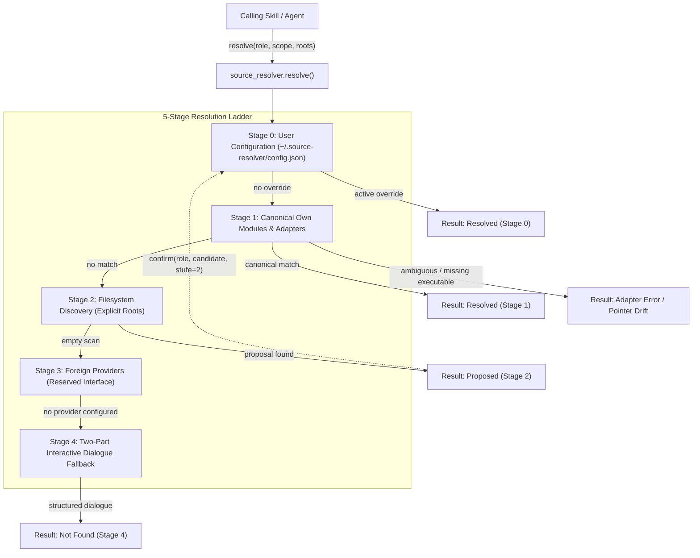
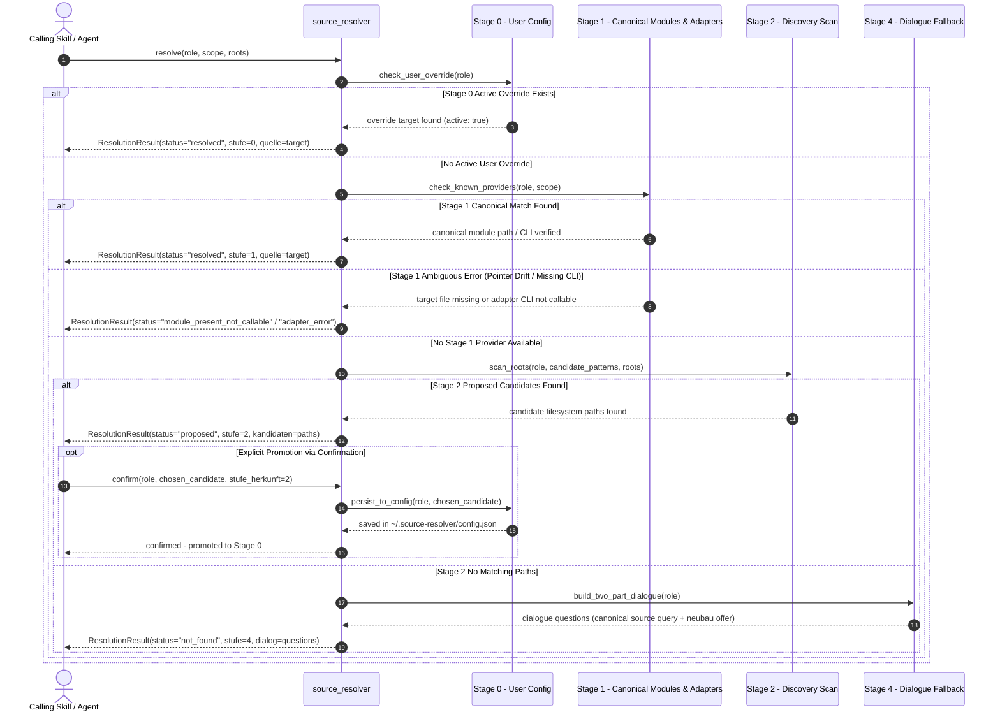

# Architecture & Design — source-resolver

Stand: 2026-09-19 | Version: 0.1.4 | Package: `ellmos-ai/source-resolver`

This document outlines the architectural structure, component responsibilities, data contracts, and the 5-stage resolution ladder of `source-resolver`.

---

## 1. Architectural Overview

`source-resolver` is a role-based, local-first source resolution system designed for autonomous AI agents and skills within the `ellmos-ai` ecosystem. Instead of hard-coding file paths or external endpoints, skills query an abstract role (e.g. `decisions.ledger` or `policy.registry`) and receive the exact runtime source location.

---

## 2. Sequence Diagram: Resolution Lifecycle

The following sequence diagram details the full lifecycle of a resolution call across all stages, including Stage-0 precedence, Stage-1 adapter invocation, Stage-2 discovery proposals, and user confirmation.

---

## 3. Component Breakdown

| Component | Module | Responsibility |
|:---|:---|:---|
| **Ladder Core** | `source_resolver.ladder` | Orchestrates the 5-stage cascade, enforces Stage-0 user precedence, evaluates adapter results. |
| **Store / Cache** | `source_resolver.store` | Manages persistent user overrides in `~/.source-resolver/config.json` with atomicity and deactivate flags. |
| **Adapters** | `source_resolver.adapters` | Specialized seams (e.g. `policy-registry`, `resources.bach.tool_registry`) invoking external CLIs or APIs fail-closed. |
| **Pointer Check** | `source_resolver.pointer_check` | Validates target existence for `type: pointer` references without silent fallback. |
| **CLI Runner** | `source_resolver.cli` | Unified command-line interface for manual inspection, debugging, and testing. |

---

## 4. Invariants & Security Guarantees

1. **User Precedence (Stage 0)**: Any active entry in `~/.source-resolver/config.json` strictly overrides built-in canonical definitions and discovery heuristics.
2. **Never Auto-Adopt Heuristics (Stage 2)**: Filesystem discovery never writes to Stage 0 silently. A human or explicit agent confirmation is required.
3. **Ambiguity Preservation**: If a provider is expected but broken (e.g. pointer drift or CLI absent), the resolver returns a distinct diagnostic status rather than masking it as "not found".
4. **Zero Network Egress**: All lookups, checks, and resolutions are entirely host-local; no remote connections or telemetries are established.
