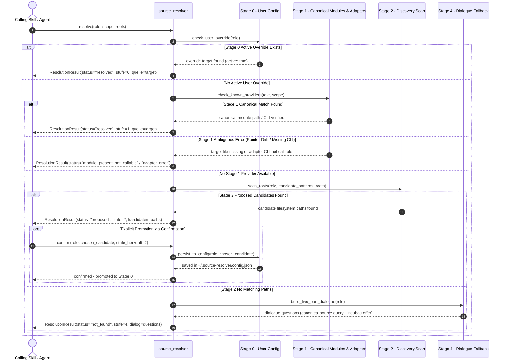

<p align="center">
  
</p>

# source-resolver

<p align="center">
  <a href="README.md"><b>English</b></a> •
  <a href="README_de.md"><b>Deutsch</b></a>
</p>

[](pyproject.toml)
[](https://www.python.org/downloads/)
[](LICENSE)
[](SECURITY.md)
[](https://github.com/ellmos-ai)
[](tests/)
[](ARCHITECTURE.md)
[](https://github.com/astral-sh/ruff)
[](llms.txt)

> [!NOTE]
> **AI & LLM Integration Notice**: This repository includes an [`llms.txt`](llms.txt) index file tailored for automated context ingestion, agentic system prompts, and LLM code understanding.

> Role-based source resolution for skills: instead of hard-wiring every information
> source (policy, decision, user model, ...), a skill calls a role --
> `source_resolver.resolve("decisions.ledger")` -- and gets back WHERE that comes from
> for this user, on this system, right now.

**Not to be confused with** `.MODULES/.CONNECTORS/connectors` (messaging channels like
Telegram/Discord). source-resolver connects skills to information sources, not to
communication channels -- separate name, separate purpose.

## Why

On 2026-08-15, three incidents of the same failure class happened on the same day: a
tool silently created the wrong folder, a script silently wrote "0 skills" instead of
failing, and a pointer-skill had been pointing at nothing for three weeks, unnoticed.
Common denominator: a silent failure that looks like a valid state.

Skills that hard-wire their sources carry exactly this risk built in -- if a module
moves or its path changes, nobody notices until an agent runs into nothing.
source-resolver makes resolution explicit, staged, and checkable.

## The ladder

| Stage | Name | Meaning |
|---|---|---|
| 0 | User configuration | `~/.source-resolver/config.json`, `aktiv: true`. ALWAYS wins -- even against a present, working canonical module. |
| 1 | Own module | Our canonical modules (see `KNOWN_MODULE_PROVIDERS` in `ladder.py`). Once found, authoritative automatically, no confirmation needed. For roles with a registered adapter (currently: `policy.registry`), this stage delegates fully to the foreign module. |
| 2 | Discovery proposal | Filesystem search across explicitly supplied roots. Result is a **proposal** -- never adopted automatically; must be confirmed via `confirm()` before it becomes Stage 0. |
| 3 | Foreign provider | Registered external providers. Currently **none** -- see "What's deliberately missing". |
| 4 | Not found | Not a report but a two-part dialogue: (a) "where is that canonical for you?", (b) if unknown: "should we set up our own supplementary module for this?" |

**Core rule (from the assignment):** *What can silently diverge when copied is not
copied, but called.* That's why the ladder is ONE component skills call -- not a
pattern every skill copies for itself.

Any ambiguous stage-1 finding (module present but CLI not installed; module folder
present but target file missing/pointer drift; caller error such as a missing `scope`)
is returned as its **own, specific result** -- not silently buried in the generic
"nothing found" dialogue.

### Resolution Lifecycle Sequence Flow



## Usage

```python
from source_resolver import resolve, confirm

result = resolve("decisions.ledger")
if result.status == "resolved":
    print(result.quelle)          # {"id": "_DECISIONS-chain", "module_path": "...", ...}
elif result.status == "proposed":
    # Stage 2: ask the user, then:
    confirm("decisions.ledger", result.kandidaten[0], stufe_herkunft=2)
elif result.status == "not_found":
    print(result.dialog["frage_1"])
    print(result.dialog["frage_2_falls_unbekannt"])
```

CLI:

```bash
source-resolver resolve decisions.ledger
source-resolver resolve policy.registry --scope dev-hygiene
source-resolver confirm decisions.ledger '{"pfad": "/own/place/DECISIONS.md"}'
source-resolver list-roles
source-resolver check-pointer "<HOME>/OneDrive/.TOPICS/.AI/.MODULES/.CONTROL/ticket-master"
```

`check-pointer` is the reusable existence check for `type: pointer` skills (see
`pointer_check.py`) -- directly motivated by T-20260815-603417673 (a `ticket-master`
pointer that pointed at nothing for three weeks, unnoticed). This function is callable
standalone, e.g. from `catalog.py` or `skill_tester.py`, should wiring it in there
become its own ticket -- **that wiring is deliberately NOT done here**, only provided.

## Existing stage-1 roles

| Role | Source | Path |
|---|---|---|
| `policy.registry` | Module `policy-registry` | Adapter -> `policy-registry resolve --scope ...` (CLI); falls back to `module_present_not_callable` if not installed |
| `decisions.ledger` | `_control-center/_DECISIONS/TO-DECIDE-USER.txt` | File check |
| `user.model` | `_control-center/_TOM-lm/avatar/START.md` | File check. **Consent is NOT part of this resolution** -- tom-lm/decision-avatar's own consent rule ("mere reachability of a profile file is not consent") remains the calling skill's responsibility. |
| `memory.organic` | Gardener | CLI presence check (`shutil.which("gardener")`) instead of a path check -- Gardener is pip/editable-installed, no fixed module folder under `<HOME>`. |
| `memory.curated` | USMC | CLI presence check (`shutil.which("usmc")`) instead of a path check, same reasoning. |
| `resources.inventory` | `.SYNC/_inventory/inventory.db` | File check (`module_path`+`target`, like `decisions.ledger`). Canonical resources/hardware/software inventory (SQLite, 9 tables); authority sits with the ControlRoom programme -- ellmos-controlcenter-mcp's `controlcenter_list_resources` is a read-only mirror, not a second canon. |
| `resources.bach.tool_registry` | BACH `tool_registry` | Read-only adapter via `bach_api.tool_registry`; returns active BACH tools as a structured source without opening `bach.db` directly from the resolver. |

## Second axis (resources/capabilities) -- first role wired

The ticket's third amendment widens the assignment: the same question doesn't only
apply to knowledge (policy, decision, user model), but to resources too ("which video
editing tool do I have, which DB, which MCP server?"). The ladder is **already generic
enough** for this -- `resolve(rolle, ...)` doesn't distinguish "knowledge role" from
"capability role", a role is just a dotted string. What's missing is NOT a second
mechanism, but the **population**: `KNOWN_MODULE_PROVIDERS` entries for resource roles
(e.g. `capability.video-editing`) and hooking into the already-canonical data cascade
(`.AI/CLAUDE.md`, "Software as storage point and GUI") for the "nothing found -> skill
provisions its own storage" case. The BACH role is implemented as an optional,
fail-closed adapter; further resource roles remain follow-up candidates.

The adapter calls BACH through `bach_api.tool_registry.list()`. It reads active entries
by default, can filter names and paths through a query, and returns a distinct Stage-1
finding when BACH is unavailable. The separate `tool_patterns` registry is deliberately
outside this role.

## What's deliberately missing (scope cut per advisor review 2026-08-15)

- **Stage-3 foreign providers:** the interface exists (`FOREIGN_PROVIDERS` in
  `ladder.py`), the list is empty. A half-working foreign provider invites trust it
  hasn't earned -- an honest "no foreign providers configured" fits the spirit of
  stage 4 better than an example stub.
- **`skill_export`** (module->skill half of the asymmetry) -- paper-only, deferred per
  decision D-20260731-005. This repo only builds the skill->source half.
- **Retrofitting `tom-lm`/`decide`/`load-project` onto this library** -- only
  `work-autonomous` was retrofitted as a reference example (see its own changelog).
- **MCP adapter** -- the manifest's surface list currently only carries `library`+`cli`.

## Proposal for `.MODULES/composition.rules.json`

The three roles named in the assignment (`policy.registry`, `decisions.ledger`,
`user.model` -- the last renamed from `user_model` for consistency with the existing
dotted vocabulary, e.g. `memory.curated`) are **proposed only**, not entered -- that's
an intervention into the shared toolkit and belongs to the user. File:
[`proposals/composition.rules.proposal.json`](proposals/composition.rules.proposal.json),
rationale: [`proposals/PROPOSAL-NOTE.en.md`](proposals/PROPOSAL-NOTE.en.md)
(German original: [`proposals/PROPOSAL-NOTE.md`](proposals/PROPOSAL-NOTE.md)).

## Tests

```bash
python -m pytest tests/ -ra -v
```

49/49 green (as of 2026-09-19), including automated contract tests for PEP 621 metadata, CI matrix coverage, security policy SLAs, architecture contracts, and regression anchors for pointer-drift, user configuration precedence, and the BACH read-only tool registry seam.

## Namensraum-Abgrenzung

NICHT zu verwechseln mit .MODULES/.CONNECTORS/connectors -- jenes Modul verbindet Messaging-Kanaele (Telegram/Discord/Signal/WhatsApp/Home Assistant/Webhooks). source-resolver verbindet Skills mit INFORMATIONSQUELLEN (Policies/Entscheidungen/Nutzermodell/...). Getrennter Name, getrennter Zweck -- siehe SYSTEM-MANIFEST §4 (keine parallelen Standards).
