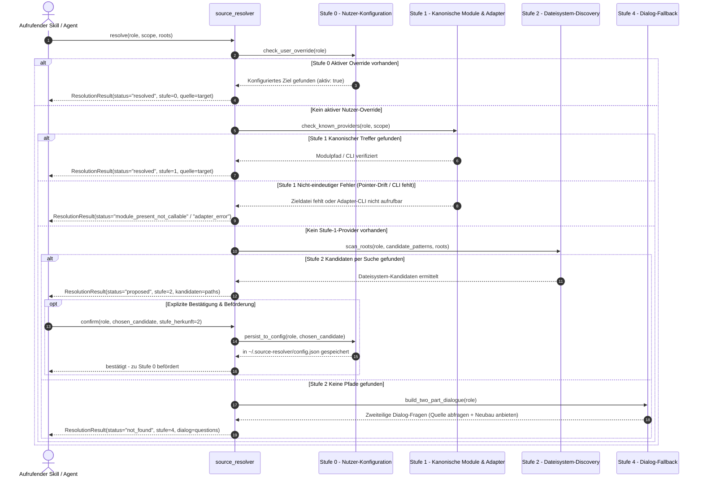

<p align="center">
  
</p>
<!-- alternate banner: assets/banner-b.png (swap on occasion) -->

# source-resolver

<p align="center">
  <a href="README.md"><b>English</b></a> •
  <a href="README_de.md"><b>Deutsch</b></a>
</p>

[](pyproject.toml)
[](https://www.python.org/downloads/)
[](LICENSE)
[](SECURITY.md)
[](https://github.com/ellmos-ai)
[](tests/)
[](ARCHITECTURE.md)
[](https://github.com/astral-sh/ruff)
[](llms.txt)

> [!NOTE]
> **LLM/KI-Kontext-Index:** Eine maschinenlesbare Spezifikation für KI-Agenten befindet sich in [`llms.txt`](llms.txt).

> Rollenbasierte Quellenaufloesung fuer Skills: statt jede Informationsquelle (Policy,
> Entscheidung, Nutzermodell, ...) hart zu verdrahten, ruft ein Skill eine Rolle auf --
> `source_resolver.resolve("decisions.ledger")` -- und bekommt zurueck, WO das fuer
> diesen Nutzer, auf diesem System, gerade herkommt.

**Nicht zu verwechseln mit** `.MODULES/.CONNECTORS/connectors` (Messaging-Kanaele wie
Telegram/Discord). source-resolver verbindet Skills mit Informationsquellen, nicht mit
Kommunikationskanaelen -- getrennter Name, getrennter Zweck.

## Warum

Am 15.08.2026 traten am selben Tag drei Vorfaelle derselben Fehlerklasse auf: ein
Werkzeug legte still einen falschen Ordner an, ein Skript schrieb still "0 Skills"
statt zu scheitern, und ein Pointer-Skill zeigte seit drei Wochen unbemerkt ins Leere.
Gemeinsamer Nenner: ein stiller Fehlschlag, der wie ein gueltiger Zustand aussieht.

Skills, die ihre Quellen hart verdrahten, haben genau dieses Risiko eingebaut -- zieht
ein Modul um oder aendert sich sein Pfad, merkt das niemand, bis ein Agent ins Leere
laeuft. source-resolver macht die Aufloesung explizit, gestuft und pruefbar.

## Die Stufenleiter

| Stufe | Name | Bedeutung |
|---|---|---|
| 0 | Nutzer-Konfiguration | `~/.source-resolver/config.json`, `aktiv: true`. Gewinnt IMMER -- auch gegen ein vorhandenes, funktionierendes eigenes Modul. |
| 1 | Eigenes Modul | Unsere kanonischen Module (siehe `KNOWN_MODULE_PROVIDERS` in `ladder.py`). Bei Fund automatisch massgeblich, keine Rueckfrage noetig. Fuer Rollen mit registriertem Adapter (aktuell: `policy.registry`) delegiert diese Stufe vollstaendig an das fremde Modul. |
| 2 | Discovery-Vorschlag | Dateisystem-Suche in explizit uebergebenen Wurzeln. Ergebnis ist ein **Vorschlag** -- wird NIE automatisch uebernommen, sondern muss per `confirm()` bestaetigt werden, bevor er Stufe 0 wird. |
| 3 | Fremdanbieter | Registrierte externe Provider. Aktuell **keine** -- siehe "Was hier bewusst fehlt". |
| 4 | Nichts gefunden | Kein Report, sondern ein zweiteiliger Dialog: (a) "wo ist das fuer dich kanonisch?", (b) falls unbekannt: "sollen wir dir ein eigenes Zusatzmodul dafuer einrichten?". |

**Kernregel (aus dem Auftrag):** *Was sich beim Kopieren unbemerkt auseinanderentwickeln
kann, wird nicht kopiert, sondern aufgerufen.* Deshalb ist die Stufenleiter EINE
Komponente, die Skills aufrufen -- nicht ein Muster, das jeder Skill fuer sich kopiert.

Jeder nicht-eindeutige Stufe-1-Befund (Modul vorhanden, aber CLI nicht installiert;
Modul-Ordner da, Zieldatei fehlt/Pointer-Drift; Aufrufer-Fehler wie fehlender `scope`)
wird als **eigenes, spezifisches Ergebnis** zurueckgegeben -- nicht still im generischen
"nichts gefunden"-Dialog versteckt.

### Sequenzdiagramm des Auflösungsablaufs



## Nutzung

```python
from pathlib import Path
from source_resolver import resolve, confirm

result = resolve("decisions.ledger")
if result.status == "resolved":
    print(result.quelle)          # {"id": "_DECISIONS-chain", "module_path": "...", ...}
elif result.status == "proposed":
    # Stufe 2: Nutzer fragen, dann:
    confirm("decisions.ledger", result.kandidaten[0], stufe_herkunft=2)
elif result.status == "not_found":
    print(result.dialog["frage_1"])
    print(result.dialog["frage_2_falls_unbekannt"])
```

CLI:

```bash
source-resolver resolve decisions.ledger
source-resolver resolve policy.registry --scope dev-hygiene
source-resolver confirm decisions.ledger '{"pfad": "/eigener/Ort/DECISIONS.md"}'
source-resolver list-roles
source-resolver check-pointer "<HOME>/OneDrive/.TOPICS/.AI/.MODULES/.CONTROL/ticket-master"
```

`check-pointer` ist der wiederverwendbare Existenz-Check fuer `type: pointer`-Skills
(siehe `pointer_check.py`) -- direkter Bezug zu T-20260815-603417673 (drei Wochen toter
Pointer in `ticket-master/SKILL.md`). Diese Funktion ist eigenstaendig aufrufbar, z.B.
von `catalog.py` oder `skill_tester.py`, falls das Nachziehen dort in einem eigenen
Ticket erfolgt -- **das ist hier bewusst NICHT verdrahtet**, nur bereitgestellt.

## Vorhandene Stufe-1-Rollen

| Rolle | Quelle | Weg |
|---|---|---|
| `policy.registry` | Modul `policy-registry` | Adapter -> `policy-registry resolve --scope ...` (CLI), faellt auf `module_present_not_callable` zurueck, wenn nicht installiert |
| `decisions.ledger` | `_control-center/_DECISIONS/TO-DECIDE-USER.txt` | Datei-Check |
| `user.model` | `_control-center/_TOM-lm/avatar/START.md` | Datei-Check. **Einwilligung ist NICHT Teil dieser Aufloesung** -- die Consent-Regel von tom-lm/decision-avatar ("blosse Erreichbarkeit ist keine Einwilligung") bleibt Sache des aufrufenden Skills. |
| `memory.organic` | Gardener | CLI-Praesenzcheck (`shutil.which("gardener")`) statt Pfad-Check -- Gardener ist pip/editable-installiert, kein fester Modulordner unter `<HOME>`. |
| `memory.curated` | USMC | CLI-Praesenzcheck (`shutil.which("usmc")`) statt Pfad-Check, gleiche Begruendung. |
| `resources.inventory` | `.SYNC/_inventory/inventory.db` | Datei-Check (`module_path`+`target`, wie `decisions.ledger`). Kanonisches Ressourcen-/Hardware-/Software-Inventar (SQLite, 9 Tabellen); Hoheit liegt beim ControlRoom-Programm -- ellmos-controlcenter-mcps `controlcenter_list_resources` ist Lese-Spiegel, keine zweite Kanonik. |
| `resources.bach.tool_registry` | BACH `tool_registry` | Read-only-Adapter über `bach_api.tool_registry`; liefert aktive BACH-Werkzeuge als strukturierte Quelle und öffnet `bach.db` nicht direkt durch den Resolver. |

## Zweite Achse (Ressourcen/Fähigkeiten) – erste Rolle angebunden

Der dritte Nachtrag zum Ticket erweitert den Auftrag: dieselbe Frage stellt sich nicht
nur fuer Wissen (Policy, Entscheidung, Nutzermodell), sondern auch fuer Ressourcen
("welches Videoschnitt-Programm habe ich, welche DB, welcher MCP-Server?"). Die
Stufenleiter ist dafuer **bereits generisch genug** -- `resolve(rolle, ...)` kennt keine
Unterscheidung zwischen "Wissens-Rolle" und "Faehigkeits-Rolle", eine Rolle ist nur ein
gepunkteter String. Was fehlt, ist NICHT ein zweiter Mechanismus, sondern die
**Population**: `KNOWN_MODULE_PROVIDERS`-Einträge für Ressourcen-Rollen (z.B.
`resources.bach.tool_registry`, weitere `capability.*`-Rollen folgen) und die Anbindung an die bereits kanonische Datenkaskade
(`.AI/CLAUDE.md`, "Software als Speicherpunkt und GUI") für den Fall "nichts gefunden ->
Skill legt sich selbst Speicher an". Die BACH-Rolle ist als optionaler, fail-closed
Adapter umgesetzt; weitere Ressourcenrollen bleiben Kandidaten für Folgetickets.

Der Adapter fragt BACH über `bach_api.tool_registry.list()` ab. Er liest standardmäßig
nur aktive Einträge, kann per Query Name und Pfad filtern und gibt bei fehlender BACH-
Installation einen eigenen Stufe-1-Befund zurück. Das getrennte `tool_patterns`-Register
ist nicht Teil dieser Rolle.

## Was hier bewusst fehlt (Schnitt vom advisor-Review 2026-08-15)

- **Stufe-3-Fremdanbieter:** das Interface existiert (`FOREIGN_PROVIDERS` in
  `ladder.py`), die Liste ist leer. Ein halb funktionierender Fremdanbieter erzeugt
  Vertrauen, das er nicht verdient hat -- ein ehrliches "keine Fremdanbieter
  konfiguriert" ist im Sinn von Stufe 4 richtiger als ein Beispiel-Stub.
- **`skill_export`** (Modul->Skill-Haelfte der Asymmetrie) -- Papierstand, zurueckgestellt
  per Entscheid D-20260731-005. Diese Repo baut nur die Skill->Quelle-Haelfte.
- **Retrofit von `tom-lm`/`decide`/`load-project` auf diese Bibliothek** -- nur
  `work-autonomous` wurde als Referenzbeispiel umgestellt (siehe dortiges Changelog).
- **MCP-Adapter** -- Surface-Liste im Manifest traegt aktuell nur `library`+`cli`.

## Vorschlag fuer `.MODULES/composition.rules.json`

Die drei im Auftrag genannten Rollen (`policy.registry`, `decisions.ledger`,
`user.model` -- letztere umbenannt von `user_model` fuer Konsistenz mit der
existierenden gepunkteten Vokabel, z.B. `memory.curated`) werden **nur vorgeschlagen**,
nicht eingetragen -- das ist ein Eingriff in den Baukasten und liegt beim Nutzer. Datei:
[`proposals/composition.rules.proposal.json`](proposals/composition.rules.proposal.json),
Begruendung: [`proposals/PROPOSAL-NOTE.md`](proposals/PROPOSAL-NOTE.md).

## Tests

```bash
python -m pytest tests/ -ra -v
```

50/50 grün (Stand 2026-09-22), inkl. automatisierter Vertragstests für PEP 621 Metadaten, CI-Matrix-Härtung, Security-Policy-SLAs, Architektur-Vertrag sowie Regressionsanker für Pointer-Drift, Stufe-0-Nutzervorrang und die read-only BACH-Werkzeugregister-Schnittstelle.
